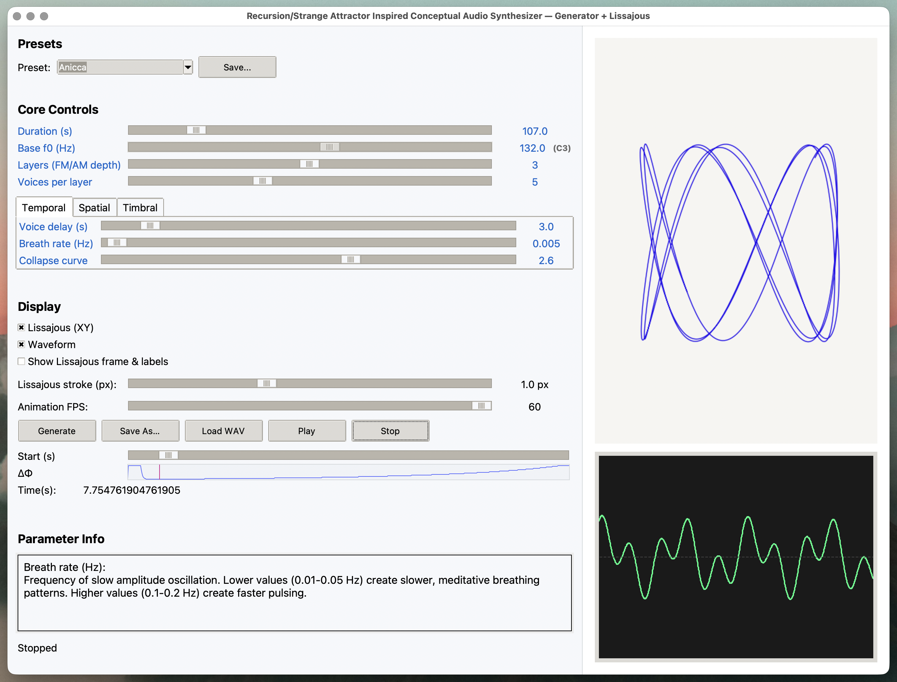

# **Phasefold**

Phasefold is a generative sound and visual synthesis tool that creates evolving
harmonic textures based on recursive processes.

At its core, it builds sound from a base tone, a steady fundamental frequency
that anchors the entire composition. Around this base tone, multiple layers of
oscillators (each with their own slow movements and modulations) interact to
create rich overtones, spatial effects, and evolving harmonic patterns.

Each layer evolves at a slightly different speed and depth, shaping the sound
through frequency (FM), amplitude (AM), and spatial modulation, including subtle
binaural phase shifts that add depth and motion.

Users can tweak the starting settings that influence how the sound unfolds.
These initial choices act like seeds. These seeds are simple rules that grow and
transform over time as the audio builds in layers. The base tone determines the
central pitch, while layers introduce motion, complexity, and harmonic richness.
Wider stereo settings create a more expansive spatial field, and subtle changes
to modulation depth or breath rate can shift the overall mood from still and
meditative to dynamically alive.

**Every adjustment alters how the piece grows, resonates, and eventually returns
to its base tone**.

The result exceeds a simple weighted sum: the components interact
transformatively rather than additively. Recursion generates evolution;
projection and decay determine its resolution.

Generated audio can then be viewed using
[Lissajous figures](https://barbegenerativediary.com/en/tutorials/lissajous-figures-exploring-patterns-born-of-waves-and-vibrations/)
This was chosen as it displays harmonic relationships between the left and right
channels so that subtle modulations in each channel are visible. With this, you
can both hear and see the differences when paramaters are adjusted.

---

### 🎥 Demo

**[View demo](https://www.loom.com/share/3a4015ec5a194989aca2258bbe519c7a)**

Preview:

## 

### ⚠️ Listening guidance

- PhaseFold produces **pure sine waves** and **binaural tones**. Keep playback
  **quiet** — these sounds are designed for subtlety, not loudness. Extended
  playback at high volumes could cause discomfort.
- **Headphones recommended.** If using speakers, place one to your left and one
  to your right at ear level, roughly **60–70 cm (≈2 ft)** from your ears.

---

### ⚠️ Development note

- PhaseFold is partially vibe-coded and is far from perfect. It contains
  numerous magic numbers and has a few bugs, unoptimised code and some smells to
  fix. It started off as an idea around how I could apply mathematically theory
  (dynamical systems, strange attractors etc) to programmatically generate audio
  and after satisfying results I decided to expand it into multi-featured audio
  synthesizer. This is a slightly-polished proof-of-concept and as my Python
  skills grow (I'm primarly a JavaScript developer), I will make incremental
  improvements or port it to a web app where I'm more confident with coding
  better UI.

---

## 🛠️ Installation and setup

### 1. Requirements

- Python 3.11+
- macOS / Windows / Linux
- Recommended: 8 GB RAM if you plan to render long (5–10 min) textures

### 2. Get the code

Clone the repo (or download the folder and open it in VS Code.)

### 3. Install dependencies

Before installing, make sure `pip` is available:

```bash
python3 -m ensurepip --upgrade
```

If you see an error like `command not found: pip` or `'pip' is not recognized`:

**macOS / Linux:**

```bash
python3 -m ensurepip --upgrade
```

**Windows:**

```powershell
py -m ensurepip --upgrade
```

## 🎧 How to use it

1. **Launch the app**

MacOS/Linux

```bash
  python3 phasefold.py
```

Windows

```bash
  python phasefold.py
```

1. **Set the seed values**
   - Use the dropdown menu under **Presets** to select one of the built‑in sound
     configurations or create your own.
   - Adjust sliders to experiment with duration, frequency, modulation depth and
     spatial effects.
   - Clickable parameter labels: Click on any parameter’s label (e.g., _Curve_,
     _Breath_, _Layers_) to see a short tooltip explaining what it does. This is
     useful when learning how each control affects the sound.
   - Direct numeric entry: Click directly on the numeric value next to a slider
     to type in an exact number. This is great for precision adjustments beyond
     what the mouse allows.

2. **Generate audio**
   - Press **Generate** to render the sound according to your current
     parameters.

3. **Export**
   - Use **Save As** to export the rendered audio as a 16‑bit stereo WAV file.
   - Files are normalized to roughly −1.5 dBFS for consistent loudness.

### Presets

Users can save and manage their own parameter configurations as presets directly
from the interface.

- **Saving presets** — Click the **Save As** button next to the preset dropdown
  to save the current parameter set.
- **Storage location** — Presets are stored in a file named `presets.json`,
  located in the same directory as `phasefold.py`.

---

## 🎛️ Tips for using the parameter sliders

Each control shapes a different part of the sound. Try changing **one** thing at
a time, then press **Generate** again — it makes it easier to hear what changed.

- **Duration (s)** — How long the piece evolves for. Short (2–5 s) = test/debug.
  Long (30–300 s) = meditative, evolving textures.
- **Root frequency (Hz)** — The pitch everything is built around. 60–120 Hz
  feels grounded; 150–300 Hz feels bright/voicy. The UI shows the nearest note
  name (e.g. `82.5 Hz (E2)`).
- **Voices per layer** — More voices = richer, thicker sound, but also more
  motion. If the visualizer looks too busy, lower this first.
- **Layers** — Think of layers as “depth.” 1–2 layers = clear/structural. 4–5
  layers = complex, slowly folding sound fields.
- **Voice delay (s)** — Lets the base tone start first and the extra voices fade
  in later. Good for “arriving” textures.
- **Breath rate** — Low values = gentle stereo sway. Higher = more obvious
  shimmering.
- **Stereo width** — 0.0 = mono. 0.2–0.5 = natural space. >0.6 = wide, slightly
  unreal field.
- **Binaural Δ (Hz)** — Difference between left/right for binaural beating. 3–10
  Hz = classic binaural effect. This value will slowly collapse over time with
  the convergence envelope.
- **Binaural amount** — How much of the binaural bed is mixed under the main
  signal. If things feel too wobbly, lower this.
- **Even / Odd harmonics** — Add harmonic color on top of the main tone. Even =
  round/sweet. Odd = nasal/brighter. These also decay with time so the piece can
  return to the base tone.
- **Comb** — Adds a subtle, shimmery resonant texture tied to the base
  frequency. Good for crystalline presets, but high values can click on fast
  attacks.
- **Collapse curve** — Controls how fast everything “comes to rest.” 1.5–3.0 is
  musical. Higher values hold the motion for longer, then let it drop quickly.

---

## How it works

Think in two rates:

1. **Control rate (60 Hz)**: a recursive background loop keeps track of a small
   set of changing values via a state vector that shapes how the sound behaves
   over time to keep it stable yet moving (using projection λ, tilt ε, and
   rotation θ). This layer handles the gradual movements: the gentle shifts,
   blends, and balances which affects parameters like envelopes, stereo image,
   and modulation depth. Once these movements are calculated, they’re stretched
   up to full audio speed so you can actually hear their effect. We **filter at
   control‑rate** for stability, then **upsample** to audio‑rate 👇

2. **Audio rate (44.1 kHz)**: this is where sound is actually created, at full
   audio speed. Multiple oscillators build the tone by continuously cycling
   through phases. Each layer adds its own gentle motion - small shifts in pitch
   and volume that shape the timbre. The base tone keeps everything centered,
   while added harmonics and subtle resonances give it texture and space. Stereo
   and binaural cues shape the pyschoacoustic sound field.

### Control‑rate recursion

At the control‑rate stage, each new state is shaped by the previous one. The
system does not reset every moment. The current tone and spatial balance gently
pull the next toward stability, while small asymmetries keep it alive and
evolving.

The 60hz control stream evolves a 2-state **state vector** using three
operators:

1. Projection (collapse toward the marked/final state) via a built-in attractor
2. Tilt (intentionally applied asymmetry)
3. Mix (bistochastic rotation on the simplex)

---

### Visualization

#### Lissajous XY

Displays a pattern created by combining two perpendicular oscillating sine
waves. You'll see these as looping curves that can range from simple ellipses to
complex patterns.

- One oscillation controls horizontal (x-axis) movement
- Another oscillation controls vertical (y-axis) movement
- The shape depends on the frequency ratio, phase difference, and amplitude of
  the two signals

It can be used in the app to visualise:

- frequency relationships
- Phase differences
- Signal distortion
- Amplitude blance
- Stereo correlation / coherence
- Binaural or spatial drift
- Modulation depth & harmonic complexity

---

### Todo

- Update preset descriptions
- Make magic numbers explicit
- Break down complex functions
- Separate audio generation logic, visualisation code and UI code into modules
- Update the overall UI
- Test to see if exposing low pass filter is safe
- Consider exposing more variables
- Disable lowpass to test if still needed

### Possible pathways to explore

- Nested cycles: smaller self-similar collapses within the larger collapse
- Spatial recursion: the geometry of recursion (mixing matrices, simplex states)
  could directly control spatial positions or reverbs — e.g., “distance from
  unity = distance from center speaker.”
- tracking how many cycles of the recursion have converged and use that as an
  aging parameter.
- Using a microphone or environmental data as part of the recursive state, or
  ambient light, heart rate, natural cycle like seasons or temperature.
- Time elasticity: allow the recursion to perceive “time dilation” — sometimes
  faster, sometimes slower — giving the experience a breathlike elasticity.
- Connect to biofeedback interface

---

### Influences & inspiration

- Éliane Radigue -
  [Beyond the Audible: Éliane Radigue's OCCAM works and Inter/Listening](https://ualresearchonline.arts.ac.uk/id/eprint/21800/6/Beyond%20the%20Audible%20%20%20liane%20Radigue%20s%20OCCAM%20works%20and%20Inter%20Listening.cleaned.pdf)
- Pauline Oliveros -
  [The difference between hearing and listening](https://www.youtube.com/watch?v=_QHfOuRrJB8)
- Ryoji Ikeda -
  - [Cyclo](https://www.ryojiikeda.com/project/cyclo/)
  - [A](https://www.ryojiikeda.com/project/A/)
- [Dynamical Systems](https://en.wikipedia.org/wiki/Dynamical_system)
- [Strange Attractors](https://www.dynamicmath.xyz/strange-attractors/)
- Hofstadter & Gödel -
  [Strange Loops / Incompleteness Theorem](https://incompletion.org/2021/08/06/tangled-hierarchy-and-strange-loop/)
- Chien-Shiung Wu -
  [Parity Violation experiments](https://www.nishina-mf.or.jp/wp/wp-content/uploads/2020/03/OCR_nkz-19.pdf)
- David Bohm -
  [Implicate Order & Holomovement](https://en.wikipedia.org/wiki/Implicate_and_explicate_order)

Playlist of relevant artists: 🎧
[Link](https://tidal.com/playlist/97e3d388-9188-47ec-96cc-f8a42ecc6fae)

### License

GNU General Public License v3.0 (GPL-3.0) © 2025
